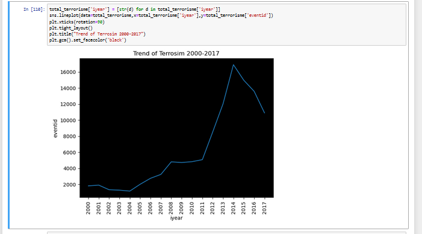

 <a href="https://achmadirfana.github.io/portofolio/portfolio-terrosism.html">Back</a>

<h2 align="center">  Global Terrorism</h2>

 URL Dashoboard project : <a href="https://terrorism.onrender.com/">Global Terrorism</a>

<h3> Background Project :</h3>

 This is project from stratascratch with level medium category of difficulty 

<h3>Purpose:</h3>

  Imagine you are a security or defense analyst. Analyze the data and draw conclusions on the distribution and nature of terrorist incidents recorded around the world. In your analysis, include maps that visualize the location of different incidents. Your analysis may also provide answers to the following questions:

• How has the number of terrorist activities changed over the years? Are there certain regions where this trend is different from the global averages? 

• Is the number of incidents and the number of casualties correlated? Can you spot any irregularities or outliers?

• What are the most common methods of attacks? Does it differ in various regions or in time?

• Plot the locations of attacks on a map to visualize their regional spread;

					       
<h3>Datas:</h3>
<h4>Dataset:</h4>

The provided compressed file globalterrorismdb_0718dist.tar.bz2 is an extract from the Global Terrorism Database (GTD) - an open-source database including information on terrorist attacks around the world from 1970 through 2017. The GTD includes systematic data on domestic as well as international terrorist incidents that have occurred during this time period and now includes more than 180,000 attacks. The database is maintained by researchers at the National Consortium for the Study of Terrorism and Responses to Terrorism (START), headquartered at the University of Maryland 

Since the number of variables and instances is very large, for this project, only data from 2000 above will be hold as data:

 <a href="https://platform.stratascratch.com/data-projects/terrorism-hotspots">Global Terrorism</a>
 

each file is data from 2015 and must be imported to jupyter notebook

<h3>Data Preparation</h3>

 All files must be put in the same folder/directory as python 

<h4>Data Validation</h4>

 All the data must be checked whetever there is blank data. The  queery for data checking blank data:

	
 

import pandas as pd 

data= pd.read_csv("data.csv") 

data.isnull().sum()/len(data)*100

 

 Output: 

 
  

<h4>Data Duplicate Checking</h4>

 Code for data duplicate checking :

	
 

  
data.duplicated('eventid').any() #Checking whetevr any duplicate data in data order column event_id 

 

 Output: 

 
  

<h3>Dat Analyze</h3>
<h4>1. Terrorist activities changed over the years and regions where this trend is different from the global averages</h4>

 The trend of terrorism over years 

 Code: 

	
 

total_terrorisme = data.groupby('iyear').count()['eventid'].reset_index() 

total_terrorisme 

 Output: 

 
  

 The trend of terrorism over years by line chart

 Code: 

	
 

total_terrorisme['iyear'] = [str(d) for d in total_terrorisme['iyear']]

sns.lineplot(data=total_terrorisme,x=total_terrorisme['iyear'],y=total_terrorisme['eventid'])

plt.xticks(rotation=90)

plt.tight_layout()

plt.title("Trend of Terrosim 2000-2017")

plt.gca().set_facecolor('black') 

 Output: 

 
  

 From graph above, the trend of terrorisme is increase year by year, so to know which region/country that don't have the same trend , need to check the average of growth of terrorisme case from year to year.

 The Code of average of growth of terrorisme case:

	
 

data_detail= data.pivot_table(index='iyear',values='eventid',columns='country_txt',aggfunc='count')

data_detail_growth= data_detail.pct_change(periods=1)*100

data_detail_growth.mean(axis=0).reset_index().sort_values(0,ascending=True).head(9)

 Output: 

 
  

<h4>2. The correlation number of incidents and the number of casualties </h4>

 Code: 

	
 

data_correlation = data.groupby(['iyear','imonth']).agg({'eventid': 'count', 'nkill': 'sum'}).reset_index()

data_correlation['year-month']= data_correlation['iyear'].astype(str) +"-"+ data_correlation["imonth"].astype(str)

data_correlation['nkill'] = [round(d) for d in data_correlation['nkill']]

plt.figure(figsize=(10, 8),)

sns.scatterplot(data=data_correlation,x='eventid',y='nkill')

plt.title('Correlation Between Number of Case and Number of Victims')

plt.xlabel('Number of Case')

plt.ylabel('Total Victims')

plt.gca().set_facecolor('black')

 Output: 

 
  

 For searching the outlier in the data, it must be calculated the gradient of the chart, code for searching the gradient of data: 

	
 

data_correlation['gradien']=data_correlation['nkill']/data_correlation['eventid'] 

 data_correlation.sort_values('gradien',ascending=False).head(2) 

 Output: 

 
  

<h4>4. The most common methods of attacks?</h4>

 Code: 

	
 

attack= data.groupby(['country_txt','attacktype1_txt','iyear']).count()['eventid'].reset_index()

px.treemap(data_frame=attack, path=['attacktype1_txt','country_txt','iyear'], values='eventid',title='Most Common Attack')
	

fig.update_traces(marker=dict(color='cyan')) 

 Output: 

 
  

<h4>4. Plot the locations of attacks on a map to visualize their regional spread</h4>

 Code: 

	
 

data_growth= data_detail_growth.mean(axis=0).reset_index()

px.choropleth(data_frame=data_growth,locations='country_txt',color=0,locationmode='country names')

 Output: 

 
  

<h3>6. Insight and Recomendation</h3>
<h4 style="margin-left: 20px">6.1 Insight</h4>

 • Based on data and graph, the graph tends to inceease year by year from 2000-2014 and the reached its peak in 2014, but there are actually a number of countries whose trend tends to decrease, such as Uzbezkistan, Morocco, and Eritrea. 
 

 • Based on data and graph, the greater the number of terrorism cases, the higher the number of victims, there were even a few months where the number of caucuses tended to be 'small, but caused a very large number of victims, namely September 2001 and March 2004.  

 • Pizzas with the chicken meat is the most sold pizzas  

 • The business is stabil in 2015 based on income with the avarge of 5% growth or loss   

<h4 style="margin-left: 20px"> 6.2 Reccmendation</h4>

 •Pizzas in sizes XL and XXL contribute very little to revenue, so to further maximize revenue 1-2 hours before closing, pizzas in XXL or XL can be scaled down to sizes S or L to increase the likelihood of being sold  

 •	Make sure the stock of chicken meat is always available because pizza with chicken meat sells very well compared to other flavors/toppings  

